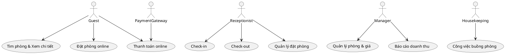
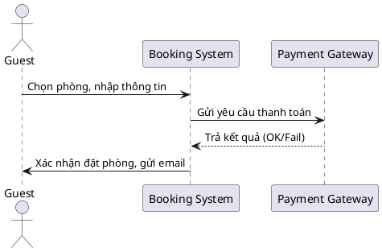
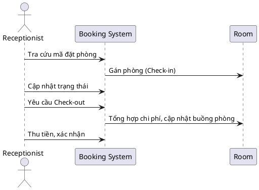
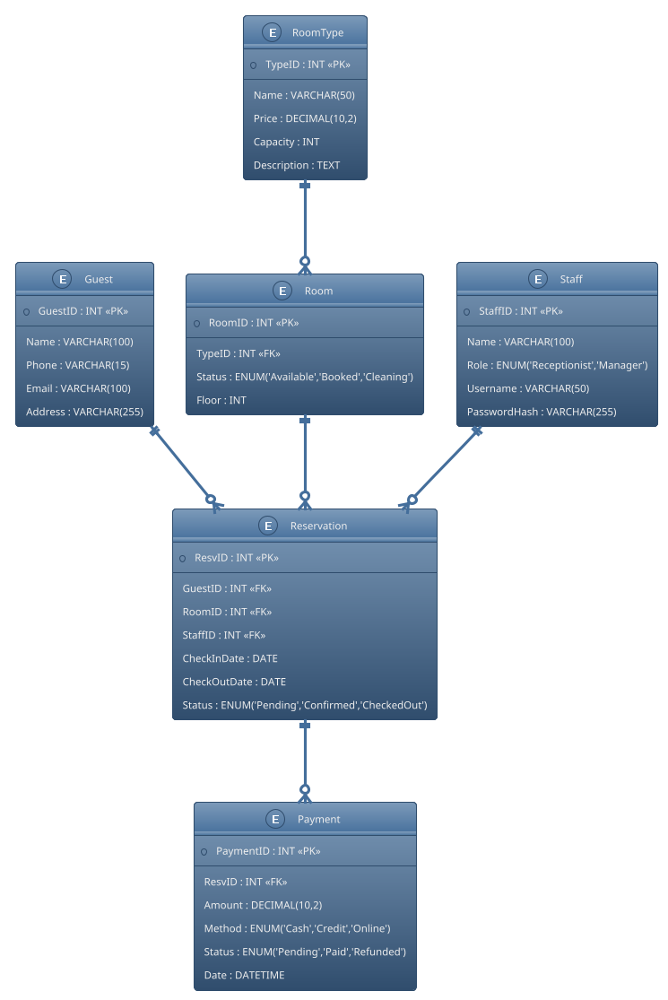

# Lab 02 – Phân tích yêu cầu & Thiết kế UML (Hotel Booking System)
👥 Thành viên nhóm
Phan Ngọc Thiên Minh _ N23DCPT094 -Leader
Nguyễn Ngọc Bảo Linh _ N23DCPT089
Lê Minh Khang _ N23DCPT083

## 🎯 Mục tiêu
- Học cách mô tả yêu cầu phần mềm bằng UML.  
- Thiết kế cơ sở dữ liệu (ERD).  
- Vẽ Use Case và Sequence Diagram.  
- Ứng dụng phương pháp Agile – Scrum với Jira.  
- Đồng bộ artefact lên GitHub.  

---

## 📝 1. Phân tích yêu cầu hệ thống

### Các thực thể (Entity chính)
- Guest (Khách hàng)  
- RoomType (Loại phòng)  
- Room (Phòng cụ thể)  
- Reservation (Đặt phòng)  
- Payment (Thanh toán)  
- Staff (Nhân viên: lễ tân, quản lý)  

### Chức năng hệ thống
- Khách hàng: tìm phòng, xem chi tiết, đặt phòng, thanh toán online.  
- Lễ tân: quản lý đặt phòng, check-in, check-out.  
- Quản lý: quản lý phòng & giá, báo cáo doanh thu.  
- Buồng phòng: cập nhật trạng thái phòng.  

---

## 🖼 2. Use Case Diagram

### Actor
- Guest  
- Receptionist  
- Manager  
- Payment Gateway  
- Housekeeping  

### Use Cases chính
- Tìm phòng, Xem chi tiết phòng  
- Đặt phòng online (Booking)  
- Thanh toán online  
- Check-in / Check-out  
- Quản lý phòng & giá  
- Quản lý đặt phòng (cho lễ tân)  
- Công việc buồng phòng  
- Báo cáo doanh thu  



---

## 🔄 3. Sequence Diagram

### a) Luồng đặt phòng online


### b) Luồng Check-in/Check-out


---

## 🗂 4. Thiết kế cơ sở dữ liệu (ERD)

### Các bảng
- **Guest(GuestID, Name, Phone, Email, Address)**  
- **RoomType(TypeID, Name, Price, Capacity, Description)**  
- **Room(RoomID, TypeID, Status, Floor)**  
- **Reservation(ResvID, GuestID, RoomID, StaffID, CheckInDate, CheckOutDate, Status)**  
- **Payment(PaymentID, ResvID, Amount, Method, Status, Date)**  
- **Staff(StaffID, Name, Role, Username, PasswordHash)**  

### ERD với PlantUML


---

## 📌 5. Agile – Scrum trên Jira

### Product Backlog
- Đăng ký/Đăng nhập khách hàng  
- Tìm phòng & Xem chi tiết phòng  
- Đặt phòng & thanh toán online  
- Check-in/Check-out (Lễ tân)  
- Quản lý phòng & giá (Manager)  
- Báo cáo doanh thu  
- Công việc buồng phòng  

### Sprint Plan
- **Sprint 1**: Auth, Tìm phòng, Xem chi tiết phòng  
- **Sprint 2**: Đặt phòng & giữ chỗ  
- **Sprint 3**: Thanh toán & Check-in/out  
- **Sprint 4**: Báo cáo, housekeeping, tối ưu & release  

### Jira Board
- To Do → In Progress → Code Review → Testing → Done  

Mỗi user story mô tả theo format:  
```
As a [role], I want [function], so that [benefit].
```

---

## ✅ Artefact cần nộp
- Use Case Diagram (.png / .drawio / PlantUML)  
- 2 Sequence Diagram (Đặt phòng, Check-in/out)  
- ERD diagram (PlantUML / PNG)  
- README.md (tài liệu mô tả)  
