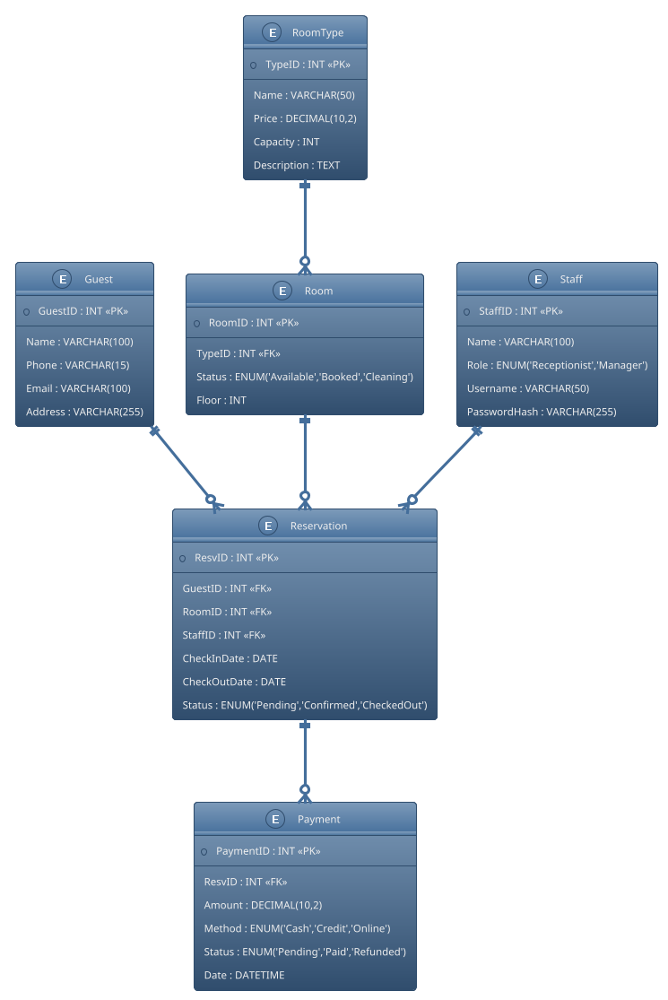

# Hotel Booking System - Database Design (Thành viên 2)

## 🎯 Nhiệm vụ
Thiết kế cơ sở dữ liệu (ERD + Entities) cho hệ thống **Hotel Booking System** trong Lab 02.

---

## 🗂 Các bảng dữ liệu chính

### 1. Guest
- GuestID (PK)
- Name
- Phone
- Email
- Address

### 2. RoomType
- TypeID (PK)
- Name
- Price
- Capacity
- Description

### 3. Room
- RoomID (PK)
- TypeID (FK → RoomType.TypeID)
- Status (Available / Booked / Cleaning)
- Floor

### 4. Reservation
- ResvID (PK)
- GuestID (FK → Guest.GuestID)
- RoomID (FK → Room.RoomID)
- StaffID (FK → Staff.StaffID)
- CheckInDate
- CheckOutDate
- Status (Pending / Confirmed / CheckedOut)

### 5. Payment
- PaymentID (PK)
- ResvID (FK → Reservation.ResvID)
- Amount
- Method (Cash / Credit / Online)
- Status (Pending / Paid / Refunded)
- Date

### 6. Staff
- StaffID (PK)
- Name
- Role (Receptionist / Manager)
- Username
- PasswordHash

---

## 🔗 Quan hệ giữa các bảng
- Guest (1) – (N) Reservation  
- RoomType (1) – (N) Room  
- Room (1) – (N) Reservation  
- Reservation (1) – (N) Payment  
- Staff (1) – (N) Reservation  

---

## 🖼 ERD (PlantUML)

---

## ✅ Artefact cần nộp
- ERD diagram (PlantUML hoặc PNG xuất từ PlantUML/Draw.io)  
- README.md mô tả chi tiết các bảng và quan hệ  

