# Hotel Booking System - Database Design (Thành viên 2)

## 🎯 Nhiệm vụ
Thiết kế cơ sở dữ liệu (ERD + Entities) cho hệ thống **Hotel Booking System** trong Lab 02.

---

## 🗂 Các bảng dữ liệu chính

### 1. Guest
- GuestID (PK)
- Name
- Phone
- Email
- Address

### 2. RoomType
- TypeID (PK)
- Name
- Price
- Capacity
- Description

### 3. Room
- RoomID (PK)
- TypeID (FK → RoomType.TypeID)
- Status (Available / Booked / Cleaning)
- Floor

### 4. Reservation
- ResvID (PK)
- GuestID (FK → Guest.GuestID)
- RoomID (FK → Room.RoomID)
- StaffID (FK → Staff.StaffID)
- CheckInDate
- CheckOutDate
- Status (Pending / Confirmed / CheckedOut)

### 5. Payment
- PaymentID (PK)
- ResvID (FK → Reservation.ResvID)
- Amount
- Method (Cash / Credit / Online)
- Status (Pending / Paid / Refunded)
- Date

### 6. Staff
- StaffID (PK)
- Name
- Role (Receptionist / Manager)
- Username
- PasswordHash

---

## 🔗 Quan hệ giữa các bảng
- Guest (1) – (N) Reservation  
- RoomType (1) – (N) Room  
- Room (1) – (N) Reservation  
- Reservation (1) – (N) Payment  
- Staff (1) – (N) Reservation  

---

## 🖼 ERD (PlantUML)

```plantuml
@startuml
!theme spacelab

entity "Guest" as Guest {
    * GuestID : INT <<PK>>
    --
    Name : VARCHAR(100)
    Phone : VARCHAR(15)
    Email : VARCHAR(100)
    Address : VARCHAR(255)
}

entity "RoomType" as RoomType {
    * TypeID : INT <<PK>>
    --
    Name : VARCHAR(50)
    Price : DECIMAL(10,2)
    Capacity : INT
    Description : TEXT
}

entity "Room" as Room {
    * RoomID : INT <<PK>>
    --
    TypeID : INT <<FK>>
    Status : ENUM('Available','Booked','Cleaning')
    Floor : INT
}

entity "Reservation" as Reservation {
    * ResvID : INT <<PK>>
    --
    GuestID : INT <<FK>>
    RoomID : INT <<FK>>
    StaffID : INT <<FK>>
    CheckInDate : DATE
    CheckOutDate : DATE
    Status : ENUM('Pending','Confirmed','CheckedOut')
}

entity "Payment" as Payment {
    * PaymentID : INT <<PK>>
    --
    ResvID : INT <<FK>>
    Amount : DECIMAL(10,2)
    Method : ENUM('Cash','Credit','Online')
    Status : ENUM('Pending','Paid','Refunded')
    Date : DATETIME
}

entity "Staff" as Staff {
    * StaffID : INT <<PK>>
    --
    Name : VARCHAR(100)
    Role : ENUM('Receptionist','Manager')
    Username : VARCHAR(50)
    PasswordHash : VARCHAR(255)
}

Guest ||--o{ Reservation : "1–N"
RoomType ||--o{ Room : "1–N"
Room ||--o{ Reservation : "1–N"
Reservation ||--o{ Payment : "1–N"
Staff ||--o{ Reservation : "1–N"

@enduml
```

---

## ✅ Artefact cần nộp
- ERD diagram (PlantUML hoặc PNG xuất từ PlantUML/Draw.io)  
- README.md mô tả chi tiết các bảng và quan hệ  

